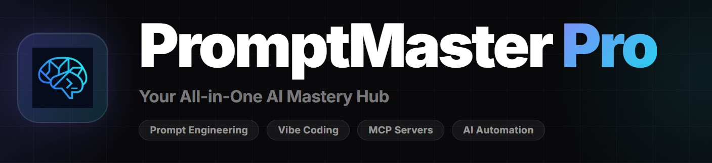
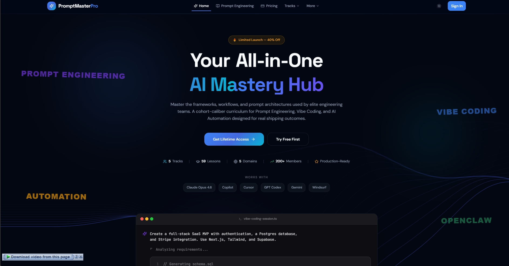
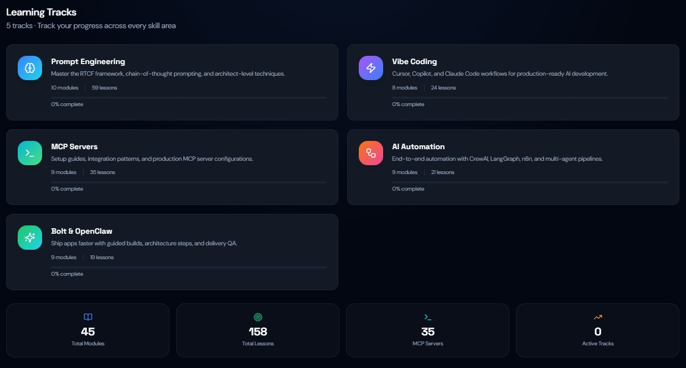
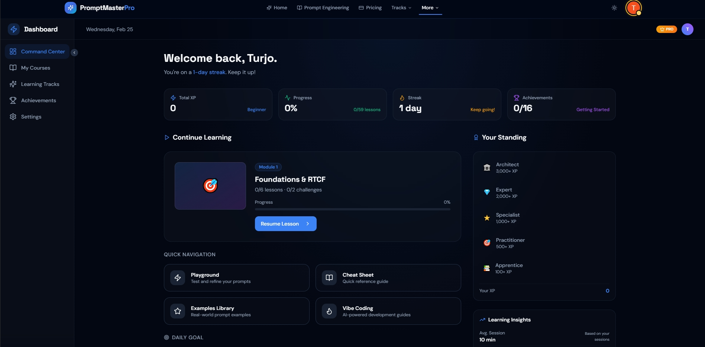
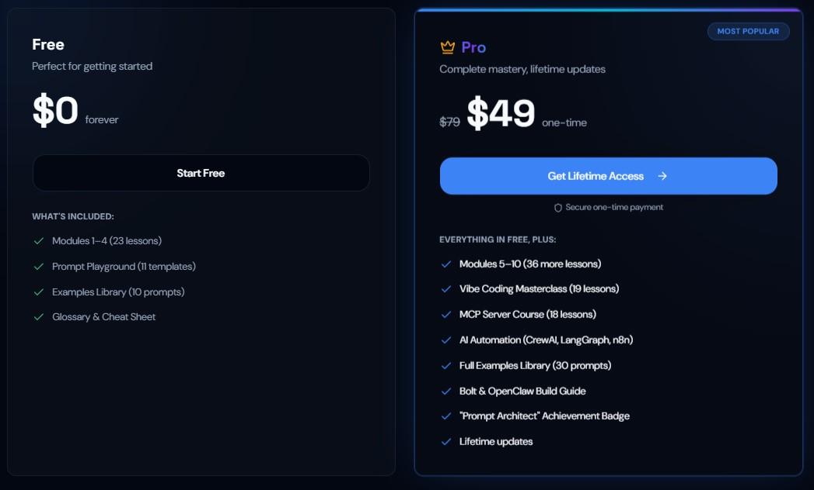

<p align="center">
  
</p>

<h1 align="center">🚀 PromptMaster Pro</h1>

<p align="center">
  <strong>Your All-in-One AI Mastery Hub</strong><br/>
  Master prompt engineering, vibe coding, MCP servers & AI automation — from beginner to architect.
</p>

<p align="center">
  <a href="#-live-demo"></a>
  <a href="#-features"></a>
  <a href="#-learning-tracks"></a>
</p>

<p align="center">
  
  
  
  
  
  
  
  
</p>

---

## 📸 Screenshots

<p align="center">
  
  <br/><em>Hero section with WebGL Threads animation, floating keywords & animated gradient text</em>
</p>

<p align="center">
  
  <br/><em>Five mastery paths — from prompt fundamentals to production AI systems</em>
</p>

<p align="center">
  
  <br/><em>Interactive dashboard with progress tracking, achievements & certificates</em>
</p>

<p align="center">
  
  <br/><em>Clean pricing page with feature comparison & bonus stack</em>
</p>

---

## 🌐 Live Demo

> **[Visit PromptMaster Pro →](https://promptmasterpro.tech)**

Experience the full platform live. The first 4 modules, Prompt Playground, Glossary, and Cheat Sheet are **completely free** — no credit card required.

---

## 📊 Platform at a Glance

| Metric | Value |
|---|---|
| **Learning Tracks** | 5 |
| **Total Lessons** | 59+ |
| **Hands-on Challenges** | 20 |
| **MCP Servers Covered** | 18+ |
| **Automation Workflows** | 19 lessons across CrewAI, LangGraph, n8n |
| **Estimated Learning Hours** | 80+ |
| **Members** | 200+ |
| **Achievement Badges** | 12 unlockable |
| **Certificate** | PDF exportable completion certificate |

---

## ✨ Features

### 🎓 Comprehensive Curriculum
- **10 structured modules** progressing from foundations to architect-level mastery
- Interactive lessons with code examples, exercises, and real-world projects
- Day-by-day structured learning path with measurable progress

### 🎮 Interactive Learning Tools
- **Prompt Playground** — 11 ready-to-use templates for hands-on experimentation
- **Examples Library** — 30 curated, production-tested prompt examples
- **Challenge Mode** — 20 hands-on challenges to test and apply your skills
- **AI Glossary** — Comprehensive reference for every term and concept
- **Cheat Sheet** — Quick-reference card for frameworks and patterns

### 🏆 Gamified Progress System
- **12 achievement badges** unlocked as you progress (e.g., "Chain Master", "Agent Creator", "Prompt Architect")
- Real-time progress tracking with animated counters
- **PDF Certificate** generation upon course completion
- Dashboard with per-module completion stats

### 🎨 Polished UI/UX
- **WebGL backgrounds** — OGL-powered animated Threads with mouse interaction
- **GSAP animations** — Smooth page transitions, scroll reveals, split text effects
- Spotlight cards, animated gradients, floating orbs, marquee text
- Fully responsive dark-themed design built with **Tailwind CSS** + **shadcn/ui**
- Accessible keyboard navigation and ARIA-labelled components

### 🔐 Authentication & Payments
- **Supabase Auth** — Google OAuth + email/password login
- **Lemon Squeezy** integration for one-time lifetime payments
- Premium content gating with smooth scroll-locked walls
- Persistent user progress across devices

---

## 📚 Learning Tracks

### 1. 🧠 Prompt Engineering — 10 Modules

The foundational track. Master the mental models and structured frameworks used by elite AI engineers.

| Module | Topic | Level |
|---|---|---|
| Day 1 | Foundations — RTCF, Persona Patterns | Beginner |
| Day 2 | Chain-of-Thought Reasoning | Beginner |
| Day 3 | Full-Stack Development Prompts | Intermediate |
| Day 4 | ML & Computer Vision Prompts | Intermediate |
| Day 5 | Advanced Prompt Patterns | Intermediate |
| Day 6 | Multimodal Engineering | Advanced |
| Day 7 | Domain-Specific Applications | Advanced |
| Day 8 | Labs & Ethics | Advanced |
| Day 9 | Enterprise AI Agents | Advanced |
| Day 10 | Future of Prompting | Expert |

### 2. ✨ Vibe Coding — 19 Tutorials

Stop writing syntax. Start orchestrating systems. Master AI-assisted development with Cursor, Copilot, and Claude Code.

- **Beginner**: Setting up AI-assisted environments, first AI pair-programming session
- **Intermediate**: Prompt chains for full-stack development, debugging workflows
- **Advanced**: System architecture prompting, multi-file refactoring, shipping production apps 10x faster

### 3. 🔌 MCP Servers — 18 Servers

Connect AI to everything using the Model Context Protocol.

- Build custom MCP servers from scratch
- Configure 18+ pre-built servers (databases, APIs, filesystem, browser, etc.)
- Deploy and orchestrate MCP in production environments
- **Estimated:** 28 hours of content

### 4. ⚡ AI Automation — 19 Lessons

Design, deploy, and scale multi-agent systems.

- **n8n** — No-code/low-code AI workflow automation
- **LangGraph** — Stateful multi-agent orchestration
- **CrewAI** — Role-based autonomous AI agent teams
- Real-world projects: SEO pipelines, client onboarding, content automation
- **Estimated:** 32 hours of content

### 5. 🚀 Bolt & OpenClaw — Build Guide

Go from zero to deployed MVP in hours using Bolt and OpenClaw. Learn the exact tech stack, prompts, and deployment workflows to bypass boilerplate.

---

## 🛠️ Tech Stack

| Layer | Technology |
|---|---|
| **Framework** | React 18.3 + TypeScript 5.8 |
| **Build Tool** | Vite 5.4 |
| **Styling** | Tailwind CSS 3.4 + shadcn/ui |
| **Animations** | GSAP 3.14 + ScrollTrigger |
| **WebGL** | OGL (Threads background) |
| **3D** | Three.js (available) |
| **Authentication** | Supabase Auth (Google OAuth + email) |
| **Database** | Supabase PostgreSQL |
| **Payments** | Lemon Squeezy |
| **Hosting** | Vercel (Edge Network) |
| **State Management** | TanStack React Query |
| **Routing** | React Router v6 |
| **Testing** | Vitest |
| **UI Components** | Radix UI primitives |
| **Certificate PDF** | jsPDF + html2canvas |

---

## 🏗️ Architecture

```
src/
├── components/
│   ├── animations/       # GSAP & WebGL animation components
│   │   ├── Threads.tsx          # OGL WebGL thread animation
│   │   ├── FloatingOrbs.tsx     # Animated floating particles
│   │   ├── ScrollReveal.tsx     # GSAP scroll-triggered reveals
│   │   ├── SplitTextReveal.tsx  # Character-by-character text animation
│   │   ├── AnimatedCounter.tsx  # Number counting animation
│   │   ├── SpotlightCard.tsx    # Mouse-tracking spotlight effect
│   │   ├── Marquee.tsx          # Infinite scroll marquee
│   │   └── ...                  # 15+ animation components
│   ├── auth/              # Supabase auth provider & guards
│   ├── security/          # Content protection components
│   └── ui/                # 40+ shadcn/ui components
├── data/
│   ├── curriculum.ts      # 10-module prompt engineering curriculum (6000+ lines)
│   ├── vibeCodingData.ts  # 19 vibe coding tutorials (1800+ lines)
│   ├── mcpData.ts         # 18 MCP server lessons (1100+ lines)
│   ├── automationData.ts  # 19 automation lessons (850+ lines)
│   └── glossary.ts        # AI terminology database
├── pages/
│   ├── Index.tsx           # Landing page with hero, tracks, testimonials
│   ├── DashboardPage.tsx   # User progress & achievements
│   ├── DayPage.tsx         # Individual module viewer
│   ├── PlaygroundPage.tsx  # Prompt playground with templates
│   ├── PricingPage.tsx     # Pricing with feature comparison
│   └── ...                 # 20 total pages
├── hooks/                  # Custom React hooks (progress, theme, mobile)
└── lib/                    # Supabase client, checkout, utilities
```

---

## 🧰 Works With

PromptMaster Pro content is designed to work across all major AI coding tools:

<p align="center">
  
  
  
  
  
  
</p>

---

## 🎯 Who Is This For?

| Audience | What You'll Get |
|---|---|
| **Developers** | Ship 10x faster with AI pair-programming workflows |
| **Freelancers** | Build and sell AI-powered automation services |
| **Startup CTOs** | Cut dev costs with Vibe Coding + MCP pipelines |
| **Marketing Teams** | Automate content, SEO, and outreach pipelines |
| **AI Researchers** | Level up from prompts to multi-agent architectures |
| **Students** | Get a competitive edge with production-ready AI skills |

---

## 💬 What Students Are Saying

> *"I went from randomly prompting ChatGPT to running a **$5k/month AI automation side-hustle**. The Agency Blueprints alone paid for this 100x over."*
> — **Sarah J.**, Freelance AI Developer

> *"Our team shipped **3 internal tools in 2 weeks** using the Vibe Coding workflows. We cancelled our $2k/mo external dev contract."*
> — **Marcus R.**, Startup CTO

> *"The MCP + Automation modules helped me build a content pipeline that **saves my team 15 hours every single week**."*
> — **Priya K.**, Marketing Agency Owner

---

## 💰 Pricing

| | Free | Pro (Lifetime) |
|---|---|---|
| **Price** | $0 | **$49** (one-time, no subscription) |
| Modules 1–4 (Foundations) | ✅ | ✅ |
| Modules 5–10 (Advanced → Architect) | ❌ | ✅ |
| Prompt Playground (11 templates) | ✅ | ✅ |
| Full Examples Library (30 prompts) | ❌ | ✅ |
| Glossary & Cheat Sheet | ✅ | ✅ |
| Vibe Coding Masterclass (19 lessons) | ❌ | ✅ |
| MCP Server Course (18 lessons) | ❌ | ✅ |
| AI Automation (CrewAI, LangGraph, n8n) | ❌ | ✅ |
| Bolt & OpenClaw Build Guide | ❌ | ✅ |
| "Prompt Architect" Badge | ❌ | ✅ |
| Lifetime updates | ❌ | ✅ |

---

## 🚀 Getting Started

```bash
# Clone the repository
git clone https://github.com/your-username/prompt-mastery-hub.git

# Navigate to the project
cd prompt-mastery-hub

# Install dependencies
npm install

# Start development server
npm run dev
```

### Environment Variables

Create a `.env` file at the project root:

```env
VITE_SUPABASE_URL=your_supabase_url
VITE_SUPABASE_ANON_KEY=your_supabase_anon_key
```

---

## 📁 Project Structure

```
prompt-mastery-hub/
├── public/               # Static assets & robots.txt
├── src/
│   ├── components/       # 60+ reusable components
│   ├── data/             # Course content (10,000+ lines)
│   ├── hooks/            # Custom React hooks
│   ├── lib/              # Supabase, checkout, utils
│   └── pages/            # 20 route pages
├── supabase/             # Database schema & edge functions
├── docs/                 # Documentation & guides
└── PromptMasterPro/      # ← You are here
```

---

## 🏅 Achievement System

Unlock badges as you progress through the curriculum:

| Badge | Name | Requirement |
|---|---|---|
| 🎯 | First Prompt | Complete your first lesson |
| 🌟 | Day One Hero | Complete Day 1: Foundations |
| 🔗 | Chain Master | Complete all Chain-of-Thought challenges |
| ⚡ | Full Stack Hero | Complete Day 3: Full-Stack Development |
| 👁️ | Vision Pro | Complete Day 4: ML & Computer Vision |
| 🏆 | Prompt Engineer | Complete all 5 foundation days |
| 🎨 | Multimodal Master | Complete Day 6: Multimodal Engineering |
| 🏢 | Domain Expert | Complete Day 7: Domain Applications |
| 🤖 | Agent Creator | Complete Day 8 & Day 9 |
| 🔮 | The Futurist | Complete Day 10: Future of Prompting |
| 🏛️ | Prompt Architect | Complete all 10 modules — final rank |

---

## 📄 License

This project is proprietary. All rights reserved.

The course content, curriculum, and materials are protected intellectual property. This repository serves as a showcase — the full platform is available at **[promptmasterpro.tech](https://promptmasterpro.tech)**.

---

<p align="center">
  <strong>Built with ❤️ for the AI builder community</strong><br/>
  <sub>© 2025 PromptMaster Pro. All rights reserved.</sub>
</p>
